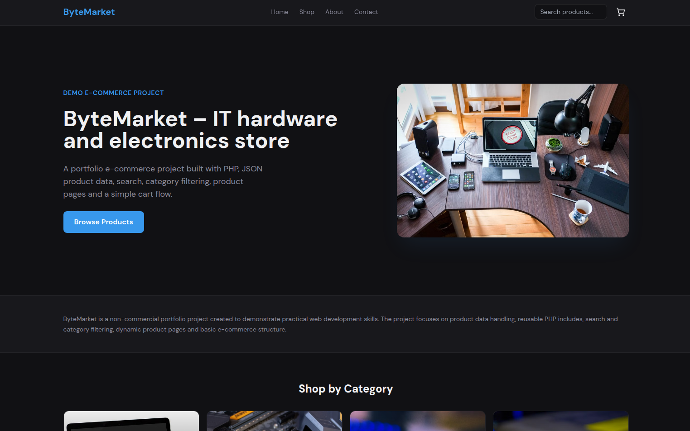
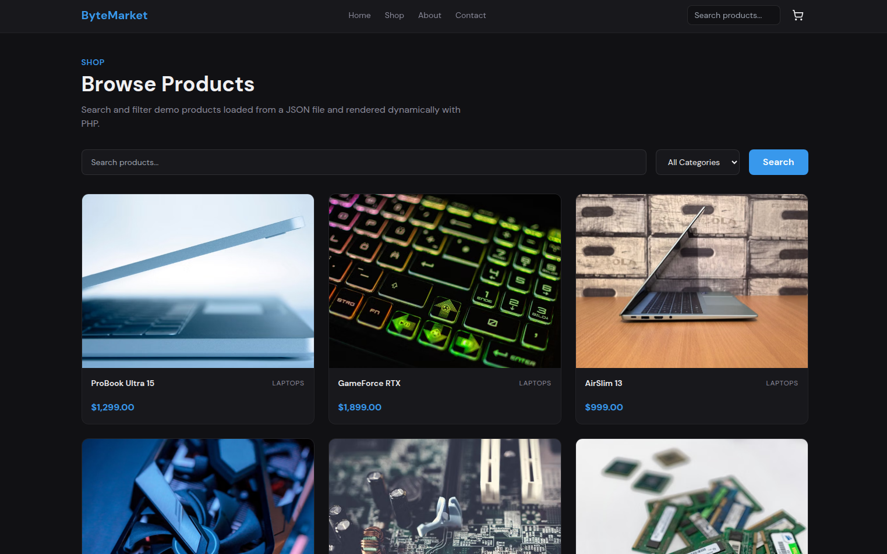
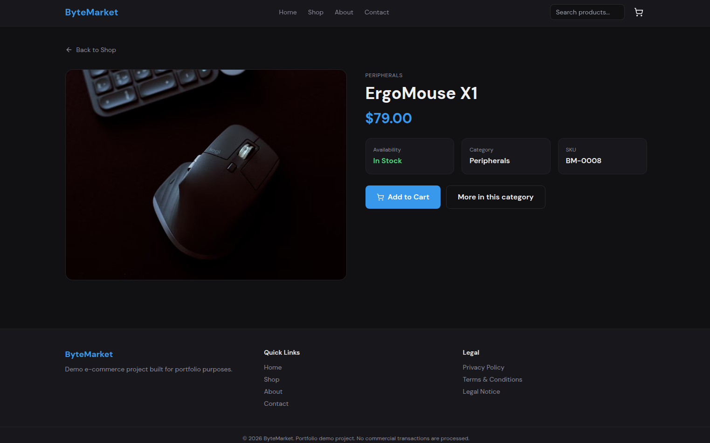
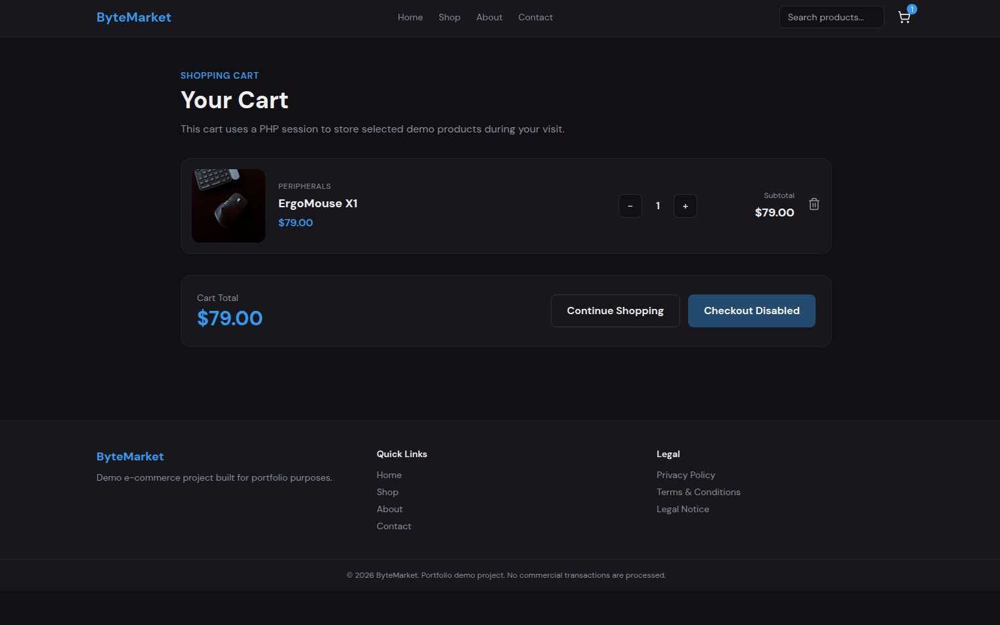
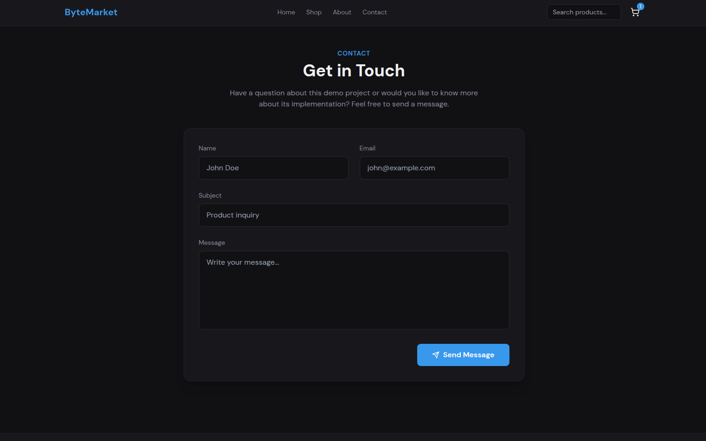

# ByteMarket

Modern PHP E-Commerce Demo Project

Live Demo:
https://bytemarket.site.je

GitHub:
https://github.com/iulianSta/ByteMarket

---

## Features

- PHP
- JSON Product Database
- Dynamic Product Pages
- Search & Category Filtering
- Shopping Cart (PHP Sessions)
- Responsive Design
- Contact Form
- Privacy Policy
- Terms of Use
- Legal Notice

---

## Technologies

- PHP
- HTML5
- Tailwind CSS
- JavaScript
- JSON
- Lucide Icons

---

## Screenshots

(Home)

(Shop)

(Product)

(Cart)

(Contact)

---

## Project Purpose

This application was created as a portfolio project to demonstrate practical PHP and web development skills.

It is **not** a commercial online shop and does not process real orders or payments.

---

## Future Improvements

- Database integration (MySQL)
- User authentication
- Admin dashboard
- Checkout flow
- Product management